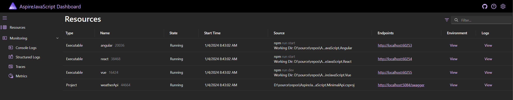

# Integrating Angular, React, and Vue with Aspire

This sample demonstrates using the Aspire JavaScript hosting integration to configure and run client-side applications.

The app consists of five services:

- **AspireJavaScript.MinimalApi**: This is an HTTP API that returns randomly generated weather forecast data.
- **AspireJavaScript.Angular**: An Angular app that consumes the weather forecast API and displays it with a featured-day hero and supporting day cards.
- **AspireJavaScript.React**: A React app (Webpack) that consumes the weather forecast API and displays the forecast.
- **AspireJavaScript.Vue**: A Vue app that consumes the weather forecast API and presents the forecast as a swipeable, keyboard-navigable day-by-day carousel.
- **AspireJavaScript.Vite**: A React + Vite + TypeScript app that consumes the weather forecast API and displays the forecast.

The four front ends all render the **same** weather data, but each one wears a **completely different design identity** — the point of the sample is to compare the frameworks side by side, so we lean into that contrast:

| Front end | Design identity | CSS approach | Icon set |
| --- | --- | --- | --- |
| **Angular** | Material 3 "expressive" — dynamic tonal color, elevated surfaces | Angular Material + SCSS | Material Symbols |
| **React** | Neo-brutalism — thick borders, hard offset shadows, chunky type | CSS Modules | Phosphor |
| **Vue** | Forecast carousel — soft cards, Vue-green gradients, day-by-day navigation | Scoped CSS + custom properties | Lucide |
| **Vite** | Retro synthwave — neon sun, 80s grid horizon | Tailwind CSS | Tabler |

Every front end is keyboard operable, ships a skip link, announces async state with `aria-live`, honors `prefers-reduced-motion` and `prefers-color-scheme`, and passes an automated `axe-core` accessibility scan in both light and dark themes.

## Pre-requisites

- [Aspire development environment](https://aspire.dev/get-started/prerequisites/)
- [.NET 10 SDK](https://dotnet.microsoft.com/download/dotnet/10.0)
- [Node.js](https://nodejs.org) - at least version 24.x

## Running the app

If using the Aspire CLI, run `aspire run` from this directory.

If using VS Code, open this directory as a workspace and launch the `AspireJavaScript.AppHost` project using either the Aspire or C# debuggers.

If using Visual Studio, open the solution file `AspireJavaScript.slnx` and launch/debug the `AspireJavaScript.AppHost` project.

If using the .NET CLI, run `dotnet run` from the `AspireShop.AppHost` directory.

### Experiencing the app

Once the app is running, the Aspire dashboard will launch in your browser:

From the dashboard, you can navigate to the Angular, React, Vue, and Vite apps.

**Angular** — Material 3 expressive

**React** — Neo-brutalism

**Vue** — Forecast carousel

**Vite** — Retro synthwave

