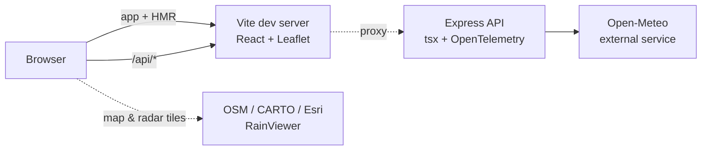
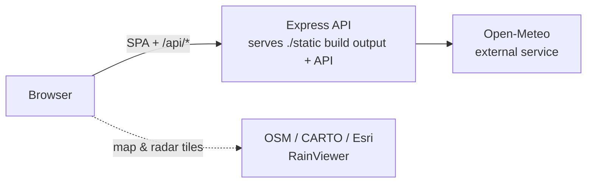

# Node.js weather explorer with Aspire

An interactive weather map backed by an Express + OpenTelemetry API that reads live data from the [Open-Meteo](https://open-meteo.com) external service, all orchestrated by a TypeScript AppHost (`apphost.mts`).

The sample consists of two apps:

- **api**: A TypeScript [Express](https://expressjs.com) API run directly with [tsx](https://tsx.is). It returns on-demand forecasts and place names by calling Open-Meteo (modeled as an Aspire external service) plus keyless reverse/forward geocoding, and serves an interactive [Scalar](https://scalar.com) API reference. OpenTelemetry instrumentation streams traces, metrics, and logs to the Aspire dashboard.
- **frontend**: A [React](https://react.dev) 19 + [Vite](https://vite.dev) app rendering a full-screen [Leaflet](https://leafletjs.com) map. Click or search any point to load real current conditions, an hourly strip, and a 5-day forecast, with an animated [RainViewer](https://www.rainviewer.com) radar overlay, switchable basemaps, geolocation, and a °F/°C toggle.

## Architecture

**Run mode:**

**Publish mode:**

## What this demonstrates

- **addExternalService + withHttpHealthCheck**: model the third-party Open-Meteo API as a first-class Aspire resource with a health check surfaced on the dashboard.
- **addNodeApp**: run the TypeScript Express API directly with `tsx` (`NODE_OPTIONS=--import tsx`).
- **addViteApp**: run the React + Vite frontend with hot module replacement.
- **withReference + waitFor**: inject the Open-Meteo URL into the API and the API URL into the frontend, and order startup so the frontend waits for the API.
- **withHttpEndpoint / withExternalHttpEndpoints / withUrlForEndpoint**: configure and label the endpoints shown in the dashboard.
- **withBrowserDebugger**: stream the frontend's browser console, network activity, and screenshots into the Aspire dashboard.
- **publishWithContainerFiles**: bundle the Vite build output into the API container so a single container serves both the SPA and the API in publish mode.
- **OpenTelemetry**: distributed traces, metrics, and structured logs from the Node.js API, viewable in the dashboard.

## Prerequisites

- [Aspire development environment](https://aspire.dev/get-started/prerequisites/)
- [Node.js](https://nodejs.org) - at least version 22.13

## Running the app

If using the Aspire CLI, run `aspire run` from this directory.

If using VS Code, open this directory as a workspace and start the AppHost with the Aspire extension.

The dashboard links to the frontend. Click any point on the map, or search for a place, to load a live forecast for that location.

## API endpoints

The `api` app exposes:

- `GET /api/weather?lat={lat}&lon={lon}` - current conditions, hourly, and 5-day forecast for a coordinate.
- `GET /api/geocode?q={query}` - forward geocoding for the search box.
- `GET /health` - health probe used by the AppHost.
- `GET /openapi.json` - the raw OpenAPI 3.1 document.
- `GET /reference` - an interactive Scalar API reference.

## Security notes

This sample keeps the API endpoints public and unauthenticated so it is easy to run and inspect locally. It does not add authentication, authorization, CSRF protection, or rate limiting, so treat it as a demo pattern rather than production-ready API security.

Inputs are validated at the boundary (latitude/longitude ranges and query lengths) and every outbound call uses a bounded timeout, but the sample calls third-party services (Open-Meteo, geocoding, and RainViewer tiles) without a caching or quota strategy. Production services should add real authN/authZ, request rate limiting, bounded request bodies, response caching, and resilient handling of upstream outages.

For production applications, see the [Node.js security best practices](https://nodejs.org/en/learn/getting-started/security-best-practices), [Express security best practices](https://expressjs.com/en/advanced/best-practice-security.html), and the [OWASP API Security Top 10](https://owasp.org/API-Security/editions/2023/en/0x11-t10/).

## Attributions

- Weather data by [Open-Meteo](https://open-meteo.com).
- Radar imagery by [RainViewer](https://www.rainviewer.com).
- Basemap tiles from [OpenStreetMap](https://www.openstreetmap.org/copyright), [CARTO](https://carto.com/attributions), and [Esri](https://www.esri.com); reverse geocoding by [BigDataCloud](https://www.bigdatacloud.com).
