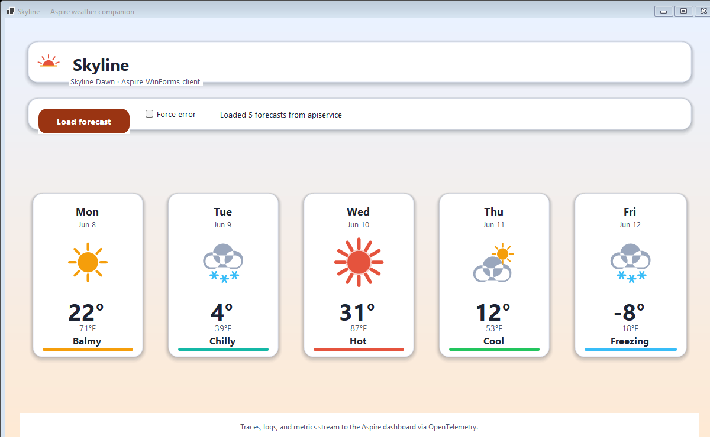
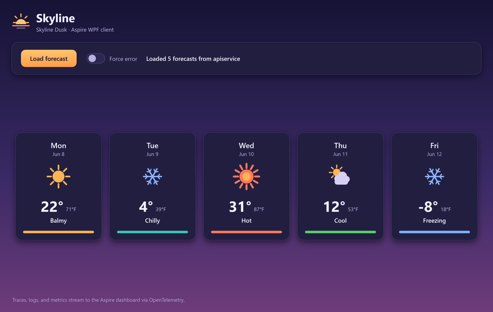

# Working with client apps in an Aspire application

This sample demonstrates working with client apps such as WinForms, WPF, etc., in an Aspire app, such that the client app is launched along with the AppHost project, can resolve services via service discovery, and logs, traces, and metrics are sent via OpenTelemetry to the dashboard.

Both client apps share one **Skyline** weather-companion identity rendered two ways: the WinForms client in a light **Dawn** palette and the WPF client in a dark **Dusk** palette. Each calls the backend weather API, renders the forecast as accessible cards, and streams its logs, traces, and metrics to the Aspire dashboard via OpenTelemetry.

The app is based on the Aspire Starter App template, with the following additional elements:

- **ClientAppsIntegration.WinForms**: This is a WinForms application that displays the results of calling the weather API service application.
- **ClientAppsIntegration.WPF**: This is a WPF application that displays the results of calling the weather API service application.
- **ClientAppsIntegration.AppDefaults**: This is a class library that defines the default configuration for orchestrated apps. It's a more general version of the typical `ServiceDefaults` class library that's included in Aspire apps. The `ClientAppsIntegration.WinForms` and `ClientAppsIntegration.WPF` projects reference this project and calls its `AddAppDefaults()` method.
- **ClientAppsIntegration.ServiceDefaults**: This has been modified from the default `ServiceDefaults` template to be based on and extend the `ClientAppsIntegration.AppDefaults` class library. The `ClientAppsIntegration.ApiService` project references this project and calls its `AddServiceDefaults()` method.

## Pre-requisites

- A Windows OS supported by .NET 10 (e.g. Windows 11)
- [Aspire development environment](https://aspire.dev/get-stated/prerequisites/)
- [.NET 10 SDK](https://dotnet.microsoft.com/download/dotnet/10.0)
- [Visual Studio 2026](https://visualstudio.microsoft.com/vs/)

## Running the app

If using the Aspire CLI, run `aspire run` from this directory.

If using Visual Studio, open the solution file `ClientAppsIntegration.slnx` and launch/debug the `ClientAppsIntegration.AppHost` project.

If using the .NET CLI, run `dotnet run` from the `ClientAppsIntegration.AppHost` directory.

In the launched WinForms and WPF apps, click the **Load forecast** button to have the app call the backend weather API and populate the forecast cards with the results. To explore the error-handling behavior, switch on the **Force error** toggle and click **Load forecast** again.

In the Aspire dashboard, use the logs, traces, and metrics pages to see telemetry emitted from the client apps.
