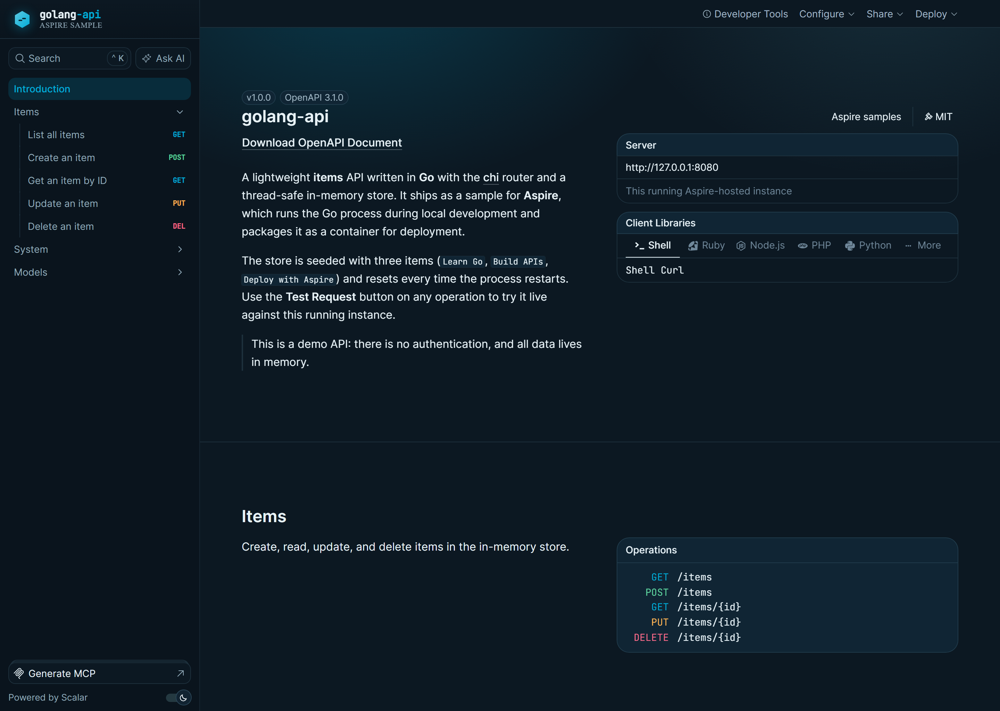
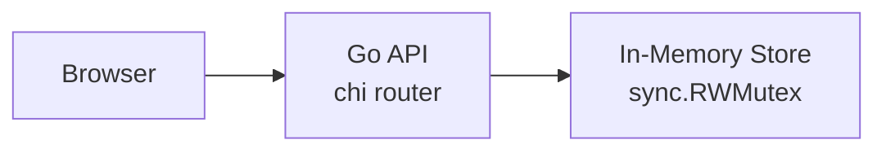

# Go API with In-Memory Storage



REST API built with Go and chi router, using in-memory storage with thread-safe operations. Opening the running app in a browser lands on a themed [Scalar](https://github.com/scalar/scalar) API reference&mdash;a polished, Go-cyan developer portal generated from the service's OpenAPI 3.1 document&mdash;while API clients keep receiving JSON.

This sample demonstrates a **TypeScript AppHost** that runs the Go API directly during local development and switches to a checked-in Dockerfile for Docker Compose publishing.

## Architecture



## What This Demonstrates

- **addExecutable**: Runs `go mod tidy` and `go run main.go` during local development
- **addDockerfile**: Builds a production container image from `api/Dockerfile`
- **withHttpEndpoint**: HTTP endpoint with PORT environment variable
- **withHttpHealthCheck**: Health check endpoint at `/health`
- **In-Memory Storage**: Thread-safe CRUD operations with sync.RWMutex
- **Chi Router**: Lightweight, idiomatic HTTP router for Go
- **Scalar API Reference**: A themed, interactive OpenAPI 3.1 reference served straight from the Go binary

## Running

```bash
aspire run
```

## Commands

```bash
aspire run      # Run locally
aspire deploy   # Deploy to Docker Compose
aspire do docker-compose-down-dc  # Teardown deployment
```

## Key Aspire Patterns

**Go Application** - Run with `go` locally, publish with a Dockerfile:
```ts
const executionContext = await builder.executionContext.get();

if (await executionContext.isPublishMode.get())
{
    await builder.addDockerfile("api", "./api")
        .withHttpEndpoint({ env: "PORT" })
        .withHttpHealthCheck({ path: "/health" })
        .withExternalHttpEndpoints();
}
else
{
    const api = await builder.addExecutable("api", "go", "./api", ["run", "main.go"])
        .withHttpEndpoint({ env: "PORT" })
        .withHttpHealthCheck({ path: "/health" })
        .withExternalHttpEndpoints();

    const goModInstaller = await builder.addExecutable("api-go-mod-installer", "go", "./api", ["mod", "tidy"])
        .withParentRelationship(api);

    await api.waitForCompletion(goModInstaller);
}
```

**Environment Variables** - Aspire injects `PORT` for HTTP endpoint configuration

## API Endpoints

- `GET /` - Themed Scalar API reference in a browser, or JSON service information for non-browser clients (chosen via `Accept`-header content negotiation, so existing JSON consumers are unaffected)
- `GET /reference` - Themed Scalar API reference (always HTML)
- `GET /openapi.json` - OpenAPI 3.1 document describing the API
- `GET /health` - Health check
- `GET /items` - List all items
- `GET /items/{id}` - Get item by ID
- `POST /items` - Create new item
- `PUT /items/{id}` - Update item
- `DELETE /items/{id}` - Delete item

## API Reference

The Go binary embeds an OpenAPI 3.1 document (`api/openapi.json`) and a custom-themed Scalar reference page (`api/reference.html`) using `//go:embed`, so no extra services or build steps are required. The reference uses a distinct Go visual identity&mdash;Gopher cyan (`#00ADD8`) accents on a deep slate canvas&mdash;and lets you call the live API straight from the page with the **Test Request** button.

Because `GET /` historically returned JSON, the root is content negotiated: browsers (which send `Accept: text/html`) land on the reference, while curl, fetch, and SDK clients keep receiving the original JSON payload. The reference is also always available at `/reference`.

## Security Notes

This sample keeps the API intentionally small for demo purposes:

- It does not implement authentication or authorization.
- Data is stored only in memory and is lost when the process restarts.
- The request body, item name, and in-memory item count limits are illustrative safeguards, not production capacity planning.
- External HTTP endpoints are enabled to make the demo easy to run and inspect.
- Production services should add real authentication, authorization, rate limiting, persistent storage, and monitoring appropriate for their threat model.

Related references:

- [Go `net/http.Server` docs](https://pkg.go.dev/net/http#Server)
- [Dockerfile best practices: user](https://docs.docker.com/build/building/best-practices/#user)
- [OWASP API Security Top 10](https://owasp.org/API-Security/editions/2023/en/0x11-t10/)
