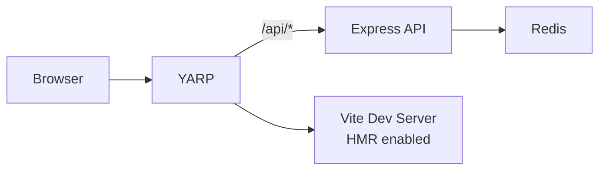
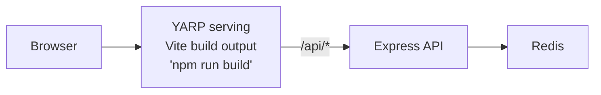

# Node.js Express + Redis + Vite Frontend

Visit counter with Express backend, Redis caching, and React TypeScript frontend using YARP.

## Architecture

**Run Mode:**


**Publish Mode:**


## What This Demonstrates

- **addNodeApp**: Express backend with Redis integration
- **addViteApp**: React + TypeScript frontend with Vite
- **addYarp**: Single endpoint for frontend and API with path transforms
- **addRedis**: In-memory data store with automatic connection injection
- **publishWithStaticFiles**: Frontend embedded in YARP for publish mode
- **Dual-Mode Operation**: Vite HMR in run mode, Vite build output in publish mode

## Running

```bash
aspire run
```

## Commands

```bash
aspire run      # Run locally
aspire deploy   # Deploy to Docker Compose
aspire do docker-compose-down-dc  # Teardown deployment
```

## Key Aspire Patterns

**YARP Routing** - Single endpoint with path-based routing:
```ts
await builder.addYarp("app")
    .withConfiguration(async (yarp) =>
    {
        const apiCluster = await yarp.addClusterFromResource(api);
        await (await yarp.addRoute("api/{**catch-all}", apiCluster))
            .withTransformPathRemovePrefix("/api");

        if (await executionContext.isRunMode.get())
        {
            const frontendCluster = await yarp.addClusterFromResource(frontend);
            await yarp.addRoute("{**catch-all}", frontendCluster);
        }
    })
    .publishWithStaticFiles(frontend);
```

**Redis Connection** - Automatic connection string injection via `REDIS_URI` environment variable

**WaitFor** - Ensures Redis starts before API
