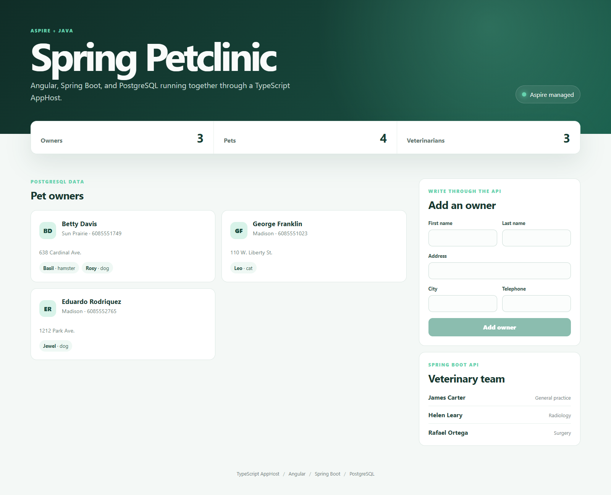

# Spring Petclinic with Angular, Spring Boot, and PostgreSQL



A compact Petclinic-style application demonstrating the official Aspire Java hosting
integration from a TypeScript AppHost.

## Architecture


The frontend lists owners, pets, and veterinarians and can create owners through the API.
The API persists data in an Aspire-managed PostgreSQL database.

## What this demonstrates

- `addJavaApp` with Maven and Spring Boot
- `withWrapperPath` for a cross-platform Maven wrapper
- PostgreSQL JDBC URL and credentials supplied through Aspire expressions
- Angular-to-API endpoint wiring without hardcoded service URLs
- Resource references, startup ordering, health checks, and external endpoints
- A TypeScript AppHost orchestrating Java, TypeScript, and a container resource

## Prerequisites

- Aspire CLI 13.6 or later
- Java Development Kit 21 or later
- Node.js 20.19, 22.13, or 24 or later
- Docker Desktop or another Docker-compatible container runtime

## Run

```bash
aspire start
```

Open the `frontend` endpoint from the Aspire dashboard. The AppHost starts PostgreSQL,
waits for it to become ready, starts the Spring Boot API, and then starts Angular.

## Project layout

- `apphost.mts` - TypeScript AppHost and resource graph
- `api` - Spring Boot REST API using Spring Data JPA
- `frontend` - Angular single-page application

On Windows, `api/tools/run-mvnw.cmd` preserves the wrapper's directory-qualified path.
This works around a 13.6 preview defect where the Java integration launches `mvnw.cmd`
without `.\`, which Windows does not resolve from the working directory.

## Security notes

This sample is intentionally small and demo-focused. Its CRUD endpoints are public and
unauthenticated, and PostgreSQL uses Aspire-generated development credentials. Do not
expose the sample directly in production without adding authentication, authorization,
request-rate controls, and production secret management.
