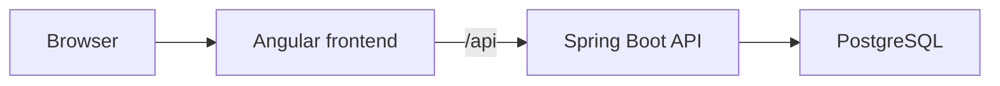

# Spring Petclinic with Angular, Spring Boot, and PostgreSQL


A compact Petclinic-style application demonstrating the official Aspire Java hosting
integration from a TypeScript AppHost.

## Architecture


```mermaid
flowchart LR
    Browser --> Angular[Angular frontend]
    Angular -->|/api| API[Spring Boot API]
    API --> PostgreSQL
```

The frontend lists owners, pets, and veterinarians and can create owners through the API.
The API persists data in an Aspire-managed PostgreSQL database.

## What this demonstrates

- `addJavaApp` with Maven and Spring Boot
- `withWrapperPath` for a cross-platform Maven wrapper
- PostgreSQL JDBC URL and credentials supplied through Aspire expressions
- Angular-to-API endpoint wiring without hardcoded service URLs
- Resource references, startup ordering, health checks, and external endpoints
- A TypeScript AppHost orchestrating Java, TypeScript, and a container resource
- Generated OpenAPI documentation and an interactive Scalar API reference
- Java agent instrumentation exporting traces, metrics, and logs to Aspire

## Prerequisites

- Aspire CLI **13.6.0**, installed using the [root installation instructions](../../README.md#aspire-version)
- Java Development Kit 21 or later
- Node.js 20.19, 22.13, or 24 or later
- Docker Desktop or another Docker-compatible container runtime

Follow the [root installation instructions](../../README.md#aspire-version) to install
the matching released CLI. The CLI/SDK and other integrations use `13.6.0`, while the
Java integration uses the accompanying `13.6.0-preview.1.26479.8` package.
All packages are available on NuGet.org; no staging feed is required.

## Run

From this sample's directory:

```bash
aspire start
```

Open the `frontend` endpoint from the Aspire dashboard. The AppHost starts PostgreSQL,
builds the API and downloads its pinned OpenTelemetry agent, waits for the database
to become ready, starts the Spring Boot API, and then starts Angular.

## Explore the API and telemetry

Open **API Reference** on the `api` resource in the Aspire dashboard to use Scalar at
`/scalar`. Its OpenAPI document is generated from the existing controllers and validation
rules at `/v3/api-docs`. Scalar and its JavaScript bundle are served by the Spring Boot API;
there is no additional frontend service or documentation build.

Use Scalar's **Test Request** to list owners or veterinarians, or create an owner in the
Angular frontend. Then select the `api` resource in the Aspire dashboard:

- **Traces** shows HTTP requests and their PostgreSQL/JDBC spans.
- **Metrics** shows JVM and HTTP measurements.
- **Structured logs** includes the `Created owner` event, correlated with its request trace.

Maven copies the pinned Java agent to `api/target/agent/opentelemetry-javaagent.jar`.
`withOtelAgentDefaultPath()` makes Aspire build the agent dependency before launching
the API. The Java integration supplies the OTLP endpoint and authentication settings;
no collector, hardcoded telemetry endpoint, or application-level telemetry SDK is needed.

## Project layout

- `apphost.mts` - TypeScript AppHost and resource graph
- `api` - Spring Boot REST API using Spring Data JPA
- `frontend` - Angular single-page application

On Windows, `api/tools/run-mvnw.cmd` preserves the wrapper's directory-qualified path.
The helper invokes `.\mvnw.cmd` explicitly so Windows resolves it from the working directory.

## Security notes

This is a trusted local demo, not a production template. Its HTTP endpoints have no
application authentication or transport encryption. Anyone who can reach the API can
read all owner records and create owners. Do not publicly expose or forward these
endpoints; the Angular development server listens on all interfaces (`0.0.0.0`).

Use synthetic data only. PostgreSQL uses Aspire-generated development credentials,
has no persistent volume configured, and should be treated as disposable. Hibernate
automatically updates the database schema (`spring.jpa.hibernate.ddl-auto=update`).
Before adapting this sample for production, add authentication, authorization,
transport encryption, request-rate controls, and production secret management.
