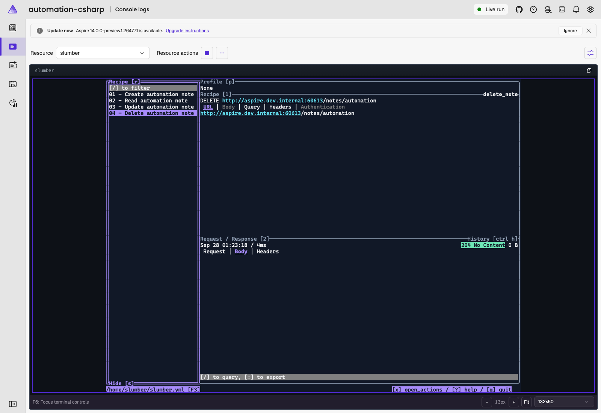

# Terminal automation: C# AppHost

Drive a real REST TUI from AppHost code. **Run terminal walkthrough** presses keys in Slumber, waits for its responses, and independently checks the API after creating, reading, updating, and deleting a note.



## Prerequisites and startup

- Aspire CLI **14.0.0-preview.1.26475.14**, matching the daily SDK/packages in this sample.
- The .NET 10 SDK selected by [`samples/global.json`](../../global.json).
- A running Linux container runtime.

See the collection's [stable-version merge requirement](../README.md#development-version). Keep the sibling [`basics-csharp`](../basics-csharp/) directory: this sample reuses its API, ServiceDefaults, and Slumber Dockerfile rather than duplicating them. It launches its **own** API, Redis, and Slumber resources; the basic AppHost does not need to be running.

From this directory:

```sh
aspire restore --apphost apphost.cs
aspire start --apphost apphost.cs --isolated
aspire wait --apphost apphost.cs
```

Open Slumber's **Console logs** in the dashboard. In **Resource actions**, choose **Run terminal walkthrough** and watch it navigate the four requests. Do not type into Slumber or resize its terminal during the walkthrough.

Alternatively, run the same command without a browser:

```sh
aspire resource slumber walkthrough --apphost apphost.cs --non-interactive
```

Success leaves **04 - Delete automation note** selected with **204 No Content**. The command logs each verified step to the Slumber resource and fails if a screen or API assertion fails. View those messages with `aspire logs slumber --apphost apphost.cs` (the output also contains the TUI's terminal escape sequences).

## What the sample demonstrates

[`apphost.cs`](./apphost.cs) acquires the resource-owned terminal with `TerminalService.TryGetTerminal("resource:slumber:0", ...)`. The final `0` identifies the only replica. It uses `SendKeyAsync` for navigation and `WaitForTextAsync` for actual rendered output; it does not use sleeps as evidence of request completion.

Each run:

1. Acquires a non-blocking semaphore so two walkthroughs cannot type simultaneously.
2. Waits for the API to be healthy and removes only the reserved `automation` note through HTTP.
3. Restarts only Slumber and waits for a new running container ID, resetting its selection and in-memory history.
4. Waits for each recipe's empty history, sends the request, and waits for its expected status. It also checks response text and verifies API state; deletion must produce an independent HTTP 404.
5. Releases the terminal handle without stopping Slumber, leaving the final response visible.

The [four recipes](./requests.yml) use `persist: false`, so saved responses cannot satisfy the next run's assertions. The request collection is mounted **read-only**; edit the repository file, not Vim inside Slumber. API endpoint injection still comes from Aspire, with no hard-coded host port.

The command honors cancellation and has a two-minute overall deadline in addition to the terminal API's per-wait timeout. Failures are logged and returned as failed resource commands. A failed run may leave the `automation` note behind; the next run resets it. No other notes are deleted.

This is deliberately a version-specific TUI automation example: changing the collection order, Slumber version, or screen layout can require updating its assertions. Human input and other clients editing the reserved note during a run are not supported. Normal manual use is available again once the command finishes.

## Repeatability and cleanup

Run the command twice to exercise both initial and repeated execution. No browser needs to be attached. The API reused here has its own focused tests:

```sh
dotnet test ../basics-csharp/tests/Notes.Tests.csproj
aspire stop --apphost apphost.cs
```

Redis data is disposable. The sample is for trusted local development; it has no application authentication. Stopping this AppHost does not stop a separately running basic sample.
