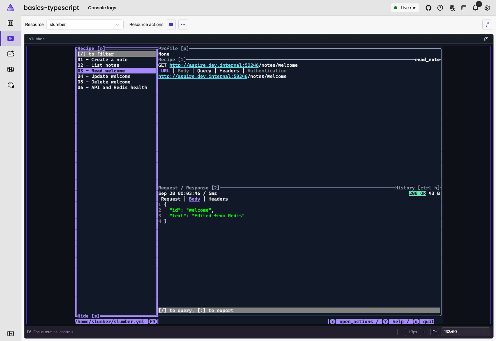

# Terminal basics: TypeScript AppHost and API

Run [Slumber](https://github.com/LucasPickering/slumber), an interactive REST client, inside the Aspire dashboard. Create a note through an Express/TypeScript API, edit it directly in Redis's authenticated REPL, then retrieve the changed value in Slumber.



## Prerequisites and startup

- [Aspire CLI](https://aspire.dev/get-started/install-cli/) **14.0.0-preview.1.26475.14**, matching this sample's daily SDK/packages. Use the installer's version option to select this build, not an older installed CLI.
- Node.js **24.18.0** (the repository CI version) and npm.
- Docker or another supported container runtime, running with Linux containers.

See the collection's [13.6 compatibility blocker](../README.md#development-version) before using the repository's default CLI version.

From this directory:

```sh
aspire restore --apphost apphost.mts
npm --prefix api ci
aspire start --apphost apphost.mts --isolated
aspire wait --apphost apphost.mts
```

Open the dashboard URL printed by Aspire. Wait for `redis` and `api` to be healthy and `slumber` to be running. The first start builds the Slumber image. Ports and the container-reachable API address are supplied by Aspire; do not enter a URL into Slumber. `aspire restore` generates the AppHost's `.aspire/modules/` bindings; do not edit or commit them.

The non-root container packages checksum-verified Slumber **5.3.0** binaries for Linux ARM64/AMD64 and includes Vim. No host Slumber or Vim installation is needed.

## What the AppHost adds

[`apphost.mts`](./apphost.mts) declares three resources:

```typescript
const redis = await builder.addRedis('redis').withRepl();

const api = await builder.addNodeApp('api', './api', 'src/index.ts')
    .withEnvironment('NODE_OPTIONS', '--import tsx --import ./src/instrumentation.ts')
    .withHttpEndpoint({ env: 'PORT' })
    .withHttpHealthCheck({ path: '/health' })
    .withReference(redis)
    .withOtlpExporter()
    .waitFor(redis);

await builder.addDockerfile('slumber', './slumber')
    .withEnvironment('BASE_URL', api.getEndpoint('http'))
    .waitFor(api)
    .withTerminal();
```

`withTerminal()` attaches to Slumber's foreground process. Redis's `withRepl()` instead adds a resource action that starts a separate, already authenticated `redis-cli`.

The API uses the Node Redis client with Aspire's `REDIS_URI` and preloads OpenTelemetry before Express. Slumber receives only the API endpoint, not Redis credentials. Its [saved requests](./slumber/slumber.yml) read that endpoint with `{{ env('BASE_URL') }}`. HTTP is intentional for this local container-to-API connection; no certificate validation is disabled.

## Try the round trip

1. Open **Console logs** for `slumber`. Focus the terminal and press **r** to focus the request list. Use **Up/Down** to select **01 - Create a note**, then **Enter** to send. Expect **201 Created** (or **200 OK** if `welcome` already exists).
2. Select **02 - List notes** or **03 - Read welcome** and press **Enter**. The JSON includes `"text": "Hello from Slumber!"`.
3. On the Resources page, open `redis`'s **Actions** menu and select **REPL**. No password entry is needed. Run:

   ```text
   HGETALL notes
   HSET notes welcome "Edited from Redis"
   HGET notes welcome
   ```

4. Hide the terminal panel and return to Slumber. Select **03 - Read welcome** and press **Enter**. Expect **200 OK** and `"text": "Edited from Redis"` without restarting the API.
5. Send **04 - Update welcome** for `"text": "Updated from Slumber!"`, then **05 - Delete welcome** for **204 No Content**. Reading the deleted note returns **404**. **06 - API and Redis health** checks readiness.

**Tab/Shift+Tab** moves between panes, **r** returns to the request list, and **?** shows help. Selecting a request loads it immediately; **Enter** sends it.

Vim is configured as the default editor. In Vim, press **i** to edit, then **Esc** and **:wq** to save and return to Slumber (**:q!** discards changes). Collection edits inside the container are disposable; edit `slumber/slumber.yml` in the repository to retain them across rebuilds.

## Data and lifecycle

The API stores plain text in the Redis hash `notes`, with note IDs as fields. IDs accept 1-40 lowercase ASCII letters, digits, or hyphens. A JSON `text` value must contain 1-1000 UTF-16 characters and cannot be whitespace-only. PUT creates (201) or replaces (200); missing reads/deletes return 404, invalid input returns 400, and Redis failures return 503. Request bodies are limited to 10 KiB.

There is no persistent volume or API-local cache. To reset only this demo's data, run `DEL notes` in the REPL, then resend the create request. Do not use `FLUSHALL`.

Type `quit` in `redis-cli` before closing its tab. Hiding a terminal panel is not a process stop. Slumber exits with **q** (or **Ctrl+C**); use its resource **Start** or **Restart** action to launch it again. Reloading the dashboard reconnects to a still-running Slumber process. Use **Fit** or the terminal size selector to adjust its layout.

Stop this sample explicitly:

```sh
aspire stop --apphost apphost.mts
```

## Checks and troubleshooting

```sh
npm run build
npm --prefix api run build
npm --prefix api test
```

The focused tests cover the API contract with an in-memory Redis substitute; the walkthrough exercises real Redis and the interactive terminals. The repository JavaScript validation discovers the AppHost and API lockfiles.

If **REPL** is missing, check `aspire --version` and restart with the matching CLI. If Slumber is waiting, inspect `api` and `redis` health first. If requests cannot connect, verify that `BASE_URL` is populated by the AppHost; do not replace it with `localhost` (which means the Slumber container itself). Changes to the Dockerfile or saved collection require rebuilding/restarting the sample.

Keep the dashboard private to trusted users: REPL users have authenticated datastore access. This unauthenticated notes API and its HTTP endpoint are for local demonstration, not production.
