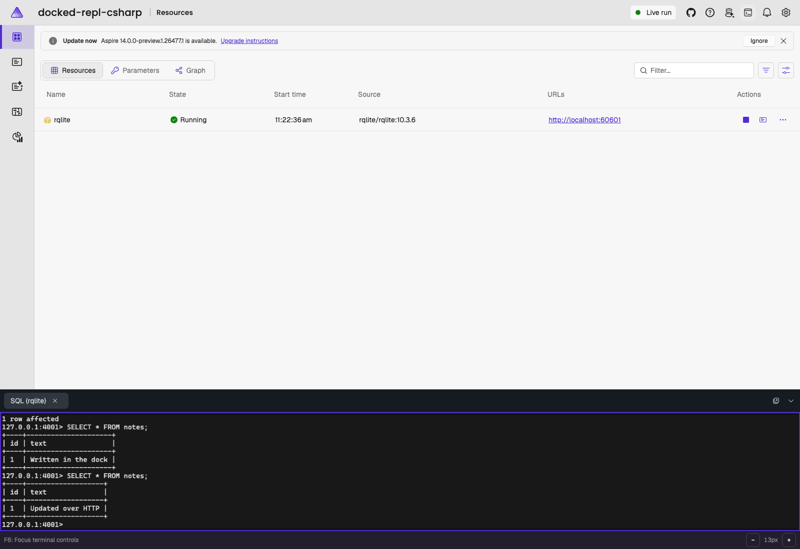

# Custom docked SQL REPL: C# AppHost

Add an integration for [rqlite](https://github.com/rqlite/rqlite), then launch its built-in SQL client in a docked Aspire terminal. rqlite is an MIT-licensed SQLite database with an HTTP API; this sample uses one node, not a cluster.



## Prerequisites and startup

- Aspire CLI **14.0.0-preview.1.26475.14**, matching this sample's daily SDK.
- The .NET 10 SDK selected by [`samples/global.json`](../../global.json).
- A running Linux container runtime. The official `rqlite/rqlite:10.3.6` image supports Linux ARM64 and AMD64.

See the collection's [13.6 compatibility blocker](../README.md#development-version). This sample keeps the collection's common version pin even though the custom SQL REPL also works with the repository's 13.6 prerelease.

From this directory:

```sh
aspire restore --apphost apphost.cs
aspire start --apphost apphost.cs --isolated
aspire wait rqlite --apphost apphost.cs
```

In the dashboard, open `rqlite`'s **Actions** menu and choose **Open SQL REPL**. The SQL shell opens in the bottom dock while the database server keeps running normally. No host installation of rqlite is needed.

## Try the SQL/HTTP round trip

In the dock, execute one statement at a time:

```sql
CREATE TABLE IF NOT EXISTS notes (id INTEGER PRIMARY KEY, text TEXT);
INSERT INTO notes VALUES (1, 'Written in the dock') ON CONFLICT(id) DO UPDATE SET text=excluded.text;
SELECT * FROM notes;
```

Copy the `http` endpoint from the resource's **URLs** column (or `aspire describe --apphost apphost.cs`). In a host shell, replace the placeholder below with that endpoint:

```sh
RQLITE_URL='http://localhost:<port-from-dashboard>'
curl --fail --get "$RQLITE_URL/db/query" \
  --data-urlencode 'q=SELECT * FROM notes'
curl --fail "$RQLITE_URL/db/execute" \
  -H 'Content-Type: application/json' \
  --data "[\"UPDATE notes SET text = 'Updated over HTTP' WHERE id = 1\"]"
```

The first response contains `[[1,"Written in the dock"]]`. Run `SELECT * FROM notes;` in the dock again: the row now says **Updated over HTTP**. The shell and HTTP clients operate on the same SQLite database. rqlite can return SQL errors inside an HTTP 200 response, so inspect the JSON `results` for errors, not just the HTTP status.

Use `.tables` or `.schema` to explore. **Type `quit` before closing the tab.** You can then select **Open SQL REPL** again for a fresh session without restarting the database.

## How the custom resource works

Everything is in [`apphost.cs`](./apphost.cs):

```csharp
builder.AddRqlite("rqlite").WithSqlRepl();
```

`RqliteResource : ContainerResource` exposes `HttpEndpoint`. `AddRqlite` pins the official image, declares its HTTP port 4001, and adds the `/readyz` readiness check. No bespoke Dockerfile or database client package is needed.

`WithSqlRepl` adds a run-mode-only resource command, enabled when the resource is running and a container ID is available. On invocation it:

1. Reads the current **`container.id`** snapshot property, rather than guessing a Docker name from the Aspire resource name.
2. Resolves the configured container runtime with `IContainerRuntimeResolver`.
3. Creates an AppHost-owned `AspireTerminal` through `TerminalService`, with `TerminalPlacement.Dock` and an argument list equivalent to `docker exec -it <container-id> /bin/rqlite -H 127.0.0.1 -p 4001`.
4. Calls `Start()` and `Show()`, then waits for the SQL prompt before reporting success. Startup failures and cancellation dispose the failed terminal and return a failed command.

The SQL client connects to the database's **container-local** loopback endpoint. Host ports and Aspire's container naming are irrelevant to that connection. Arguments are passed separately, not composed as a shell command.

Unlike `WithTerminal()`, this does not make the server's own console interactive. Unlike the built-in Redis `WithRepl()` integration, this is sample-owned code using public experimental APIs. The successful terminal intentionally outlives the command callback; disposing it there would immediately close the user's shell.

## Lifecycle and safety

Every invocation opens a separate shell. Hiding the dock does not stop it. Quitting the client ends that shell without stopping the server; closing a local runtime-exec terminal is not a reliable substitute for quitting its remote process. Restarting the database invalidates old shells, so close them and open new ones. `TerminalService` cleans up AppHost-owned terminals when the AppHost shuts down.

The sample does not attach a persistent named volume and should be treated as disposable. It intentionally omits authentication, TLS, backups, and clustering: use only for trusted local development, not production or untrusted network exposure. SQL access can alter or delete the whole database.

Stop this exact sample with:

```sh
aspire stop --apphost apphost.cs
```
