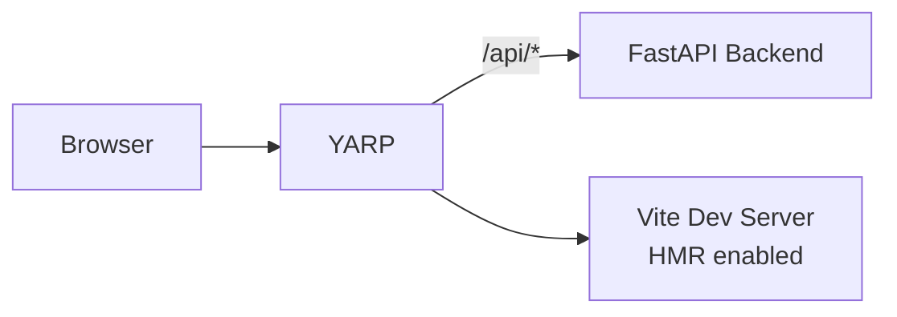

# Vite React + FastAPI

Todo app with React frontend and Python FastAPI backend using YARP for unified routing.

## Architecture

**Run Mode:**


**Publish Mode:**


## What This Demonstrates

- **addUvicornApp**: Python FastAPI backend with uv package manager
- **addViteApp**: React + TypeScript frontend with Vite
- **addYarp**: Single endpoint with path-based routing
- **withTransformPathRemovePrefix**: Strip `/api` prefix before forwarding
- **publishWithStaticFiles**: Frontend embedded in YARP for publish mode
- **Dual-Mode Operation**: Vite HMR in run mode, Vite build output in publish mode
- **Polyglot Fullstack**: JavaScript + Python working together

## Running

```bash
aspire run
```

## Commands

```bash
aspire run      # Run locally
aspire deploy   # Deploy to Docker Compose
aspire do docker-compose-down-dc  # Teardown deployment
```

## Key Aspire Patterns

**YARP with Path Transform** - Strip `/api` prefix before forwarding to FastAPI:
```ts
const api = await builder.addUvicornApp("api", "./api", "main:app")
    .withHttpHealthCheck({ path: "/health" });

const frontend = await builder.addViteApp("frontend", "./frontend")
    .withReference(api);

await builder.addYarp("app")
    .withConfiguration(async (yarp) =>
    {
        const apiCluster = await yarp.addClusterFromResource(api);
        await (await yarp.addRoute("api/{**catch-all}", apiCluster))
            .withTransformPathRemovePrefix("/api");

        if (await executionContext.isRunMode.get())
        {
            const frontendCluster = await yarp.addClusterFromResource(frontend);
            await yarp.addRoute("{**catch-all}", frontendCluster);
        }
    })
    .publishWithStaticFiles(frontend);
```

**Path Transform Example**:
- Client: `GET /api/todos`
- YARP receives: `/api/todos`
- Transform strips: `/api`
- FastAPI receives: `GET /todos`
